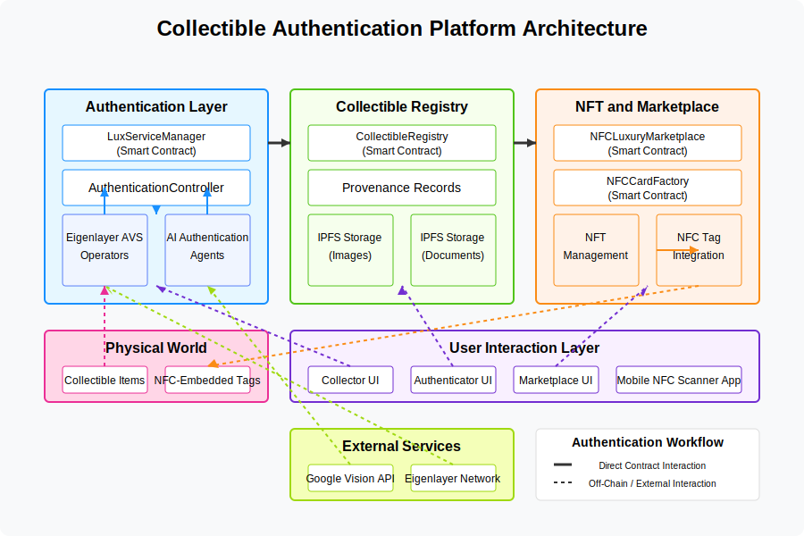

# Lux Protocol Architecture

The Lux Protocol architecture provides a comprehensive framework for authenticating luxury collectibles using decentralized AI and blockchain technology.

## Architecture Diagram

The architecture diagram (`architecture.svg`) illustrates the following key components and their relationships:

## System Components

### 1. Authentication Layer

This is the core of the system, responsible for verifying the authenticity of luxury items.

-   **LuxServiceManager (Smart Contract)**: Coordinates the authentication workflow by:

    -   Creating and tracking authentication tasks
    -   Managing operator responses
    -   Verifying signatures from authorized operators
    -   Maintaining task state and history

-   **AuthenticationController (Smart Contract)**: Implements the authentication business logic:

    -   Defines confidence thresholds for authentication
    -   Processes authentication results
    -   Applies verification rules
    -   Connects authentication results to other system components

-   **Eigenlayer AVS Operators**: Decentralized operators that stake ETH to provide authentication services:

    -   Monitor the blockchain for new tasks
    -   Process authentication requests
    -   Submit signed verifications
    -   Earn rewards for correct authentications

-   **AI Authentication Agents**: The AI models and algorithms that:
    -   Analyze images of luxury goods
    -   Compare features against known authentic patterns
    -   Detect counterfeits and replicas
    -   Calculate confidence scores

### 2. Collectible Registry

Maintains a permanent record of authenticated items and their provenance.

-   **CollectibleRegistry (Smart Contract)**: Stores:

    -   Authentication history for each item
    -   Ownership transfers
    -   Metadata about each collectible
    -   Links to off-chain storage

-   **IPFS Storage (Images)**: Decentralized storage for:

    -   High-resolution images of the collectibles
    -   Multiple angles and details
    -   Historical photos showing condition over time

-   **IPFS Storage (Documents)**: Stores supporting documentation:
    -   Certificates of authenticity
    -   Receipts and invoices
    -   Warranty information
    -   Maintenance records

### 3. NFT and Marketplace

Enables digital ownership and trading of authenticated items.

-   **NFCLuxuryMarketplace (Smart Contract)**: Provides:

    -   Listing and selling of authenticated items
    -   Auction and instant purchase mechanisms
    -   Royalty distribution
    -   Transaction history

-   **NFCCardFactory (Smart Contract)**: Creates:

    -   Digital representations of physical items
    -   NFT tokens linked to physical objects
    -   Ownership certificates

-   **NFT Management**: Handles:

    -   Minting and burning of tokens
    -   Transfer of ownership
    -   Royalty calculations
    -   Metadata management

-   **NFC Tag Integration**: Connects physical and digital:
    -   Links physical items to their digital twins
    -   Enables scanning for verification
    -   Provides tamper-evidence
    -   Stores cryptographic proofs

### 4. Physical World Layer

Represents the tangible items being authenticated and secured.

-   **Collectible Items**: The physical luxury goods:

    -   Designer fashion
    -   Watches and jewelry
    -   Limited edition items
    -   Art and collectibles

-   **NFC-Embedded Tags**: Hardware components:
    -   Cryptographically secure chips
    -   Tamper-evident packaging
    -   Scannable via mobile devices
    -   Stores unique identifiers

### 5. User Interaction Layer

All the interfaces through which users interact with the system.

-   **Collector UI**: For owners and buyers:

    -   Viewing authentication status
    -   Managing collection
    -   Transferring ownership
    -   Reviewing provenance

-   **Authenticator UI**: For verification specialists:

    -   Submitting items for authentication
    -   Reviewing AI results
    -   Providing expert input
    -   Challenging questionable results

-   **Marketplace UI**: For buying and selling:

    -   Listing items for sale
    -   Bidding on auctions
    -   Secure payments
    -   Viewing item history

-   **Mobile NFC Scanner App**: For on-the-go verification:
    -   Scanning physical NFC tags
    -   Verifying authenticity in real-time
    -   Viewing item details
    -   Reporting counterfeits

### 6. External Services

Third-party integrations that enhance the system's capabilities.

-   **Google Vision API**: Provides:

    -   Advanced image recognition
    -   Feature detection
    -   Pattern matching
    -   Anomaly detection

-   **Eigenlayer Network**: Supplies:
    -   Decentralized security
    -   Staking mechanisms
    -   Slashing for malicious operators
    -   Economic incentives for honest behavior

## Data Flow

1. **Authentication Flow**:

    - User submits item for authentication via the Authenticator UI
    - LuxServiceManager creates a new task with image and metadata hashes
    - AI Operators detect the task and process it
    - Operators sign and submit their authentication results
    - Results are recorded in the Collectible Registry

2. **Verification Flow**:

    - Collector scans NFC tag with the mobile app
    - App retrieves authentication data from the blockchain
    - Authenticity status and confidence level are displayed
    - Complete provenance history is available for review

3. **Marketplace Flow**:
    - Seller lists authenticated item on the marketplace
    - Buyers can verify authenticity before purchase
    - Upon sale, ownership is transferred on-chain
    - New owner receives digital certificate and physical item

## Security Considerations

-   **Decentralized Verification**: Multiple operators must reach consensus on authenticity
-   **Staking Requirements**: Operators must stake assets to participate, creating economic disincentives for fraud
-   **Cryptographic Proofs**: All authentications include cryptographic signatures that can be verified
-   **Tamper-Evident Hardware**: Physical NFC tags are designed to be tamper-evident
-   **Transparent History**: Complete provenance history is publicly visible and immutable

## Scaling Considerations

-   **Layer 2 Integration**: Support for Layer 2 solutions to reduce gas costs and increase throughput
-   **Parallel Processing**: Multiple operators can process tasks simultaneously
-   **Optimistic Authentication**: Fast preliminary results with slower, more thorough verification
-   **Caching Strategies**: Frequently accessed data can be cached off-chain for quick access

## Future Enhancements

-   **Multi-Chain Support**: Expanding to additional blockchains
-   **Advanced AI Models**: Incorporating more sophisticated algorithms
-   **Governance Mechanisms**: Community voting on authentication standards
-   **Reputation Systems**: Tracking operator accuracy over time
-   **Cross-Chain Verification**: Enabling verification across different blockchain networks
